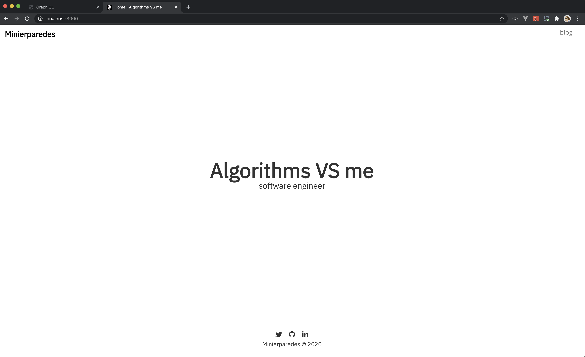
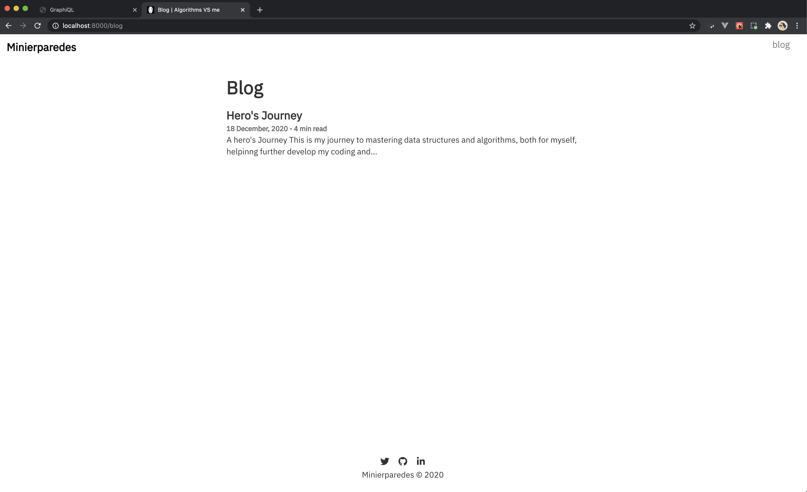
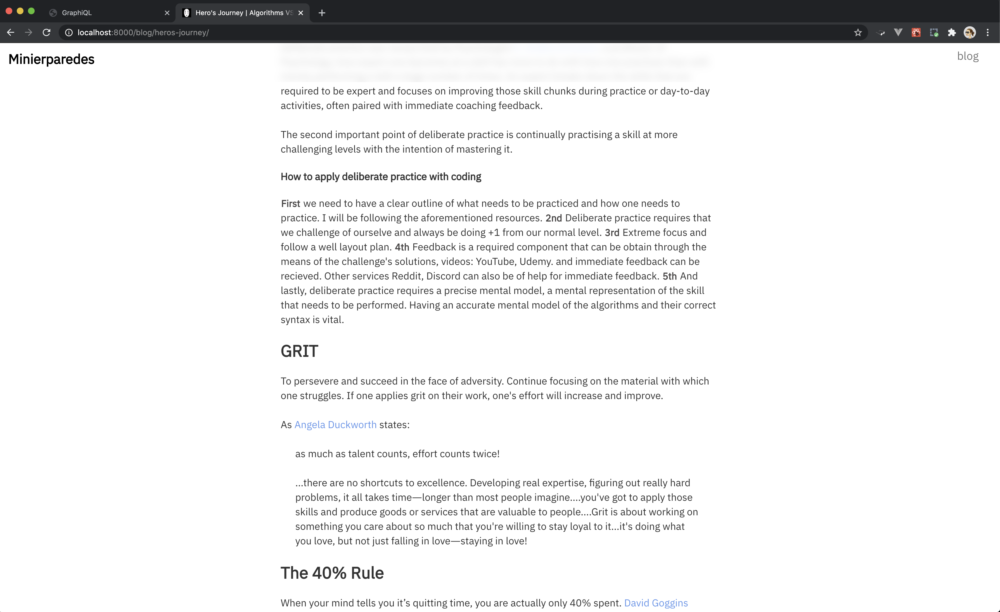

# [Portfolio Site](https://minierparedes.github.io/algorithms-vs-me/)




## Sample pages of the site

#### blog list page

<br>
<br>



<br>
<br>

#### sample blog

<br>
<br>



## Portfolio site features:

- Landingpage
- Blog overview page
- Markdown sourcing from /content folder
- Estimated reading time for each post
- Styled components with emotion
- Netlify deployment friendly
- Nunito font included as npm module
- Syntax highlighting with prismjs
- Textmarkerstyle headings inspired by Basecamp
- Site meta tags with React Helmet
- Plugins for offline support
- Draft blog posts not published

<br>
<br>

## Deployed

The site is deployed to GitHub Pages and is available now.

[](https://minierparedes.github.io/algorithms-vs-me/)

<br>
<br>

## Quick start

This starter ships with the main Gatsby configuration files you might need to get up and running blazing fast with the blazing fast app generator for React.

1.  **Create a Gatsby site.**

    Use the Gatsby CLI to create a new site, specifying the julia starter.

    ```sh
    # create a new Gatsby site using the julia starter
    gatsby new julia-starter https://github.com/niklasmtj/gatsby-starter-julia
    ```

1.  **Start developing.**

    Navigate into your new site’s directory and start it up.

    ```sh
    cd julia-starter/
    gatsby develop
    ```

1.  **Open the source code and start editing!**

    Your site is now running at `http://localhost:8000`!

    _Note: You'll also see a second link: _`http://localhost:8000/___graphql`_. This is a tool you can use to experiment with querying your data. Learn more about using this tool in the [Gatsby tutorial](https://www.gatsbyjs.org/tutorial/part-five/#introducing-graphiql)._

    Open the `julia-starter` directory in your code editor of choice and edit `src/pages/index.js` or `src/pages/blog.js`. Save your changes and the browser will update in real time!


### Roadmap

Support for app will continue with future implemations.


## Powered by

<br>
<br>

<p align="center">
  <a href="https://www.gatsbyjs.com">
    
  </a>
</p>
<h1 align="center">
  Gatsby
</h1>


<br>
<br>

### Author
[](https://github.com/minierparedes)

Minierparedes

